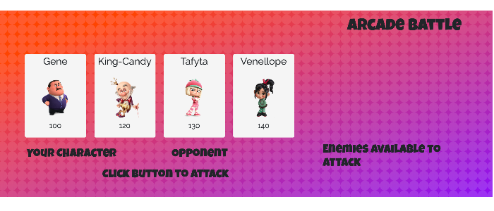

# RPG-Game
An interactive game for web browsers. Dynamically updates HTML pages with the jQuery library. An simple RPG game, arcade-themed.

### How to Play
Click on a character to begin, that becomes your character the others your enemies.  Select an enemy to attack first, then click attack button.  Your character's damage and counter attack power updates with each press of the attack button, as is the enemies damage and attck power.  Your goal is to defeat all enemies.

## Built With
* [Bootstrap](https://getbootstrap.com/) - responsive framework for web
* [Google Fonts](https://fonts.google.com/) - open source typography catalog
* Javascript
* JQuery

## Versioning & Author
This is the only version and is maintained by me, [sabomade](https://github.com/sabomade).

## Acknowledgements
Built & completed as part of the UCB Coding Bootcamp, Homework 4: Javascript & JQuery (option 2)

